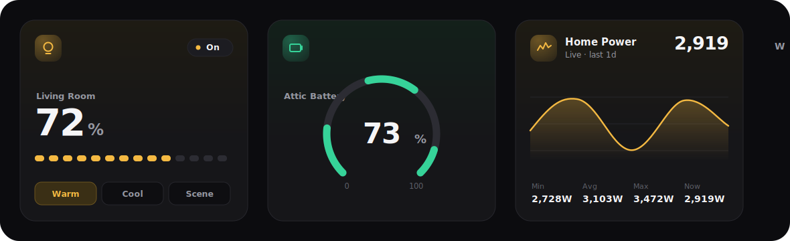

# SimUI Cards — Luminous

**A minimalist, information-dense, fully UI-editable card set for Home Assistant.**

Beautiful tiles you drop into a *normal* Lovelace dashboard — Lovelace owns the layout,
SimUI owns the cards. No YAML required: every option is in the visual editor. The design
language borrows from **Linear** (restrained dark-first palette, hairline detail, one
accent), **Apple Home** (continuous-radius cards, content-first hierarchy, an active-state
tint), and **TradingView** (thin precise charts, tabular figures, crosshair readouts) —
grounded in the look of
[UI-Lovelace-Minimalist](https://github.com/UI-Lovelace-Minimalist/UI): soft pastel state
colours, near-black cards floating on a soft shadow, 20px corners, a barely-there active
tint on a round icon disc.

These are the tiles from [simUI](https://github.com/watari-dev/ha-simui), repackaged to
sit beside Mushroom or Bubble Card on any dashboard.



---

## Cards

16 cards, all driven by the visual editor — every column below is also an option in the UI
(no YAML needed).

| Card | `custom:` type | What it does |
|------|----------------|--------------|
| **Light** | `custom:simui-light-card` | Tap the disc to toggle, drag anywhere to set brightness (or colour temperature), tap the body for more-info. Tints with the bulb's live colour; configurable preset chips. |
| **Climate** | `custom:simui-climate-card` | Thermostat tile — drag to set the target, a temperature track, fully configurable mode / preset / temperature chips, tint + icon following the HVAC action. |
| **Cover** | `custom:simui-cover-card` | Blinds / garage / shade tile — drag to set position or slat tilt, with a configurable button row (Open / Stop / Close, or your own service / position / tilt buttons). |
| **Lock** | `custom:simui-lock-card` | A lock tile tinted by state (locked → green, unlocked → amber, jammed → coral). Tap to lock / unlock. |
| **Fan** | `custom:simui-fan-card` | Fan tile — drag to set speed (snaps to the fan's step), with oscillate / preset / direction chips gated by the fan's features. |
| **Sensor** | `custom:simui-sensor-card` | The value, big, with a device-class icon + accent; optional 24 h sparkline and a 24 h delta badge. Works with `sensor` and `binary_sensor`. |
| **Gauge** | `custom:simui-gauge-card` | A radial gauge for a numeric entity — precise 270° arc, big centre value, configurable min / max / precision, and coloured **severity bands**. |
| **Graph** | `custom:simui-graph-card` | A sensor history chart powered by TradingView's [`lightweight-charts`](https://github.com/tradingview/lightweight-charts) — curved area/line, a magnet **crosshair value readout**, hairline gridlines, a range toggle (1h / 12h / 24h / 7d), an optional second series, and a min / avg / max footer. |
| **Media** | `custom:simui-media-card` | Media-player tile — album art (or a spinning music disc), title + artist, a scrubber, and transport controls gated by the player's features. |
| **Weather** | `custom:simui-weather-card` | A weather card — condition disc + big temperature, a feels-like / humidity / wind detail row, and a live forecast strip (daily / hourly). |
| **Vacuum** | `custom:simui-vacuum-card` | Robot-vacuum tile — state big (cleaning / docked / returning…), battery level, and Clean / Pause / Stop / Dock / Locate + fan-speed controls, gated by features. |
| **Alarm** | `custom:simui-alarm-card` | Alarm-panel tile — armed state big, one-tap arm / disarm (only the modes your panel supports), tinted by state. Code-protected panels defer to HA's native keypad. |
| **Select** | `custom:simui-select-card` | A tile for `select` / `input_select` — the current option big, with chips for a few options, a dropdown for many, or tap-to-cycle. |
| **Button** | `custom:simui-button-card` | A scene / script action tile — tap the glowing disc to run. Works with any tap action, no entity required; scripts show a live "Running…" state. |
| **Chips** | `custom:simui-chips-card` | A wrapping row of compact status pills — icon + value, one per entity. A glanceable status strip; a simple entity list or fully per-chip control (icon / name / colour / action). |
| **Energy Flow** | `custom:simui-energy-flow-card` | A Powerwall-style power-flow diagram — solar, grid, battery (with charge %), and home, with ribbons that colour + animate in the live direction of flow. |

---

## Install

### HACS (recommended)

1. In Home Assistant, open **HACS**.
2. Top-right **⋮** → **Custom repositories**.
3. Repository: `https://github.com/watari-dev/simui-lovelace` — Category: **Dashboard** (Lovelace plugin).
4. Find **SimUI Cards** in the list and click **Download**. HACS registers the JS resource for you.
5. **Hard-refresh** the browser (clear the dashboard cache).

### Manual

1. Download `simui-lovelace.js` from the [latest release](https://github.com/watari-dev/simui-lovelace/releases).
2. Copy it to `<config>/www/simui-lovelace.js`.
3. **Settings → Dashboards → ⋮ → Resources → Add resource**:
   - URL: `/local/simui-lovelace.js`
   - Type: **JavaScript module**
4. Hard-refresh the browser.

---

## Quick start

You almost never need YAML. Open any dashboard, click **+ Add card**, pick a **SimUI**
card from the picker, and configure it in the **visual editor** — choose an entity, set a
name, toggle the accent colour, drag in extra chips or buttons. Everything below is a
field in that editor.

If you prefer YAML, mind the `custom:` prefix:

```yaml
type: custom:simui-light-card
entity: light.living_room_ceiling
name: Ceiling              # optional — defaults to the light's name
icon: mdi:floor-lamp       # optional — overrides the device-class icon (any mdi:… name)
use_light_color: true      # optional — tile takes the bulb's colour (default); false ⇒ warm yellow
slider: dots               # dots | bar | line | none
slider_target: brightness  # brightness | color_temp
tap_action:
  action: more-info        # more-info (default) | toggle | navigate | url | perform-action | none
```

A couple more, to show the shape:

```yaml
type: custom:simui-gauge-card
entity: sensor.cpu_temperature
min: 0
max: 100
severity_fill: true
severity:                  # coloured thresholds — each band runs to the next
  - { from: 0,  color: up }    # green
  - { from: 60, color: warm }  # amber
  - { from: 85, color: down }  # coral
```

```yaml
type: custom:simui-energy-flow-card
solar: sensor.solar_power
grid: sensor.grid_power          # signed: + importing, − exporting
battery: sensor.battery_power    # signed: + discharging, − charging
battery_soc: sensor.battery_charge
home: sensor.home_power          # optional
# grid_invert: true              # if your grid sensor's sign is reversed
# battery_invert: true           # if your battery sensor's sign is reversed
```

> Accent colours (the `color:` option and per-chip / per-band colours) use a shared
> palette: `warm` (amber) · `cool` (blue) · `up` (green) · `heat` (orange) ·
> `down` (coral) · `grey`. Leave `color` unset and tiles pick a sensible tint from the
> entity's device class automatically.

---

## Presets

Drop-in pages for a sections dashboard — copy a preset's YAML, swap the placeholder entity
ids for your own, and edit any card in the visual editor. See [`presets/`](presets/).

| Preset | What's on it |
|--------|--------------|
| [Living Room](presets/living-room.yaml) | Lights + thermostat side-by-side, blinds, a full-width media tile, and a status chips strip. |
| [Energy & Power](presets/energy-power.yaml) | A Powerwall flow diagram, two power gauges, and a 24 h consumption graph — generation + consumption on one surface. |
| [Security](presets/security.yaml) | An alarm panel with one-tap arm/disarm, every lock, motion/contact sensors as a chips strip, and camera tiles. |
| [Climate & Sensors](presets/climate-sensors.yaml) | A thermostat hero, comfort gauges (temp / humidity / CO₂), a temp+humidity graph, and dense sensor tiles. |
| [Bedroom / Minimal](presets/bedroom-minimal.yaml) | The minimal per-room template: one light, one climate tile, a fan, and a two-chip strip. |

To use one: edit a dashboard → **⋮ → Edit in YAML** (or add a new view) → paste the
preset's `sections:` content. Or just lift individual cards into your existing dashboard.

---

## Features

- **Native interactions** — `tap_action`, `hold_action`, and `double_tap_action` on every
  interactive card, using HA's standard action set (`more-info`, `toggle`, `navigate`,
  `url`, `perform-action`, `none`). Right-click / long-press always opens more-info.
- **Accent colours** — one palette (`warm` / `cool` / `up` / `heat` / `down` / `grey`),
  with automatic device-class tinting when you don't pick one.
- **Compact variants** — a `compact: true` toggle on the tiles for denser dashboards.
- **Configurable chip & button rows** — opt-in `buttons:` (name · icon · tap action) on
  most cards, plus cover service buttons, climate mode chips, fan oscillate / preset /
  direction chips, vacuum controls, alarm arm modes, and light preset chips — all editable
  inline in the UI.
- **Sections-aware sizing** — every card declares a sensible grid footprint
  (`gridOptions` with `min_columns` / `min_rows`) so HA's Sections view lays it out at the
  right size instead of spanning all 12 columns.
- **Severity gauges** — radial gauges with multi-band thresholds that recolour the arc (or
  the whole fill) as the value crosses each band.
- **TradingView-grade history** — the Graph card renders with `lightweight-charts`: a
  magnet crosshair value readout, curved area/line, hairline gridlines, a range toggle,
  and an optional second series, themed to match the card.
- **Energy / power flow** — a live Powerwall-style diagram with signed grid / battery
  handling and direction-aware animated ribbons.
- **Theme-aware & live** — React rendered inside a shadow-DOM custom element, reading the
  live `hass` object HA injects, opening HA's own more-info dialog for detail.

---

## Screenshots

The hero above is a faithful preview of the Luminous look. Live screenshots of every card —
on a real dashboard — go in [`docs/screenshots/`](docs/screenshots/); see that folder's
README for the suggested filenames. Until then, the fastest way to see them is to install
and open the picker (a live preview renders for each card).

---

## Develop

```bash
npm install
npm run dev        # mock-hass harness at http://localhost:5174
npm run typecheck  # tsc --noEmit
npm run lint       # eslint
npm test           # vitest (pure util / parse logic)
npm run build      # → dist/simui-lovelace.js
```

Releases are cut from a `v*` git tag: CI builds `simui-lovelace.js` and attaches it to a
GitHub release, which is the artifact HACS downloads.

The cards are React rendered inside a shadow-DOM custom element; they read the live `hass`
object HA injects and open HA's own more-info dialog for details.

---

## Contributing

Issues and PRs are welcome. A good contribution:

- keeps the **visual editor** in step with any new config option (schema + label + helper),
- gives new tile cards a sensible **`gridOptions`** footprint so Sections view sizes them,
- returns a **`custom:`-prefixed type** from `getStubConfig` so the picker emits a resolvable config,
- **degrades gracefully** — a missing entity shows a friendly placeholder, never a crash,
- runs `npm run typecheck`, `npm run lint`, and `npm test` clean.

If you're adding a card, follow the pattern in `src/cards/*` + the registration block in
`src/main.ts`, and add it to the **Cards** table above.

---

## Licence

[MIT](LICENSE) © Watari Dev.

The Graph card bundles TradingView's
[`lightweight-charts`](https://github.com/tradingview/lightweight-charts), which is licensed
under **Apache-2.0**.
