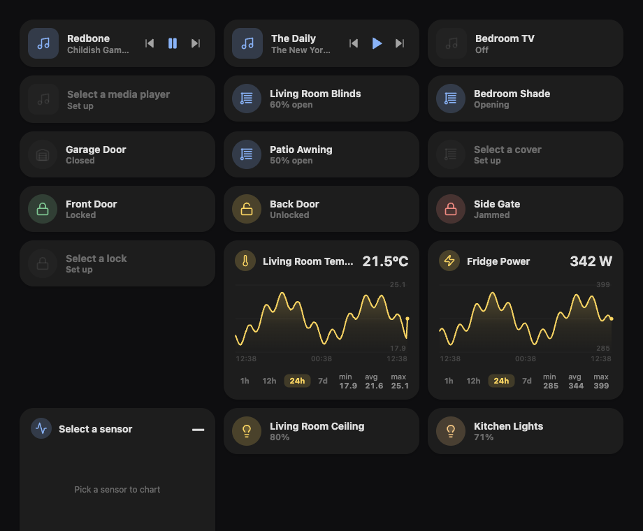

# SimUI Cards

A set of **minimalist, Apple-Home-inspired custom Lovelace cards** for Home Assistant —
the beautiful tiles from [simUI](https://github.com/watari-dev/ha-simui), repackaged to
drop into a normal Lovelace dashboard (like Mushroom or Bubble Card) instead of taking
over the whole UI. Lovelace owns the dashboard; SimUI owns the cards.

The look is grounded in [UI-Lovelace-Minimalist](https://github.com/UI-Lovelace-Minimalist/UI):
soft pastel state colours, `#1d1d1d` cards floating on a soft shadow, 20px corners, a
barely-there active tint on a round icon disc.



## Cards

| Card | `type` | What it does |
|------|--------|--------------|
| Light | `custom:simui-light-card` | Tap the disc to toggle, drag anywhere to set brightness, tap the body for more-info. Tints with the bulb's own colour; on/off-only lights just toggle. |
| Climate | `custom:simui-climate-card` | Drag the tile to set the target temperature, tap the disc to toggle on/off. Icon + tint follow the HVAC action (heating → red, cooling → blue). Shows `current → target`. |
| Sensor | `custom:simui-sensor-card` | The value, big, with a device-class icon + accent (temperature, humidity, power, pressure, battery, air quality…). Tap for more-info. |
| Graph | `custom:simui-graph-card` | A sensor history chart — thin line + soft gradient fill, gridlines, a crosshair value readout, a range toggle (1h/12h/24h/7d) and min/avg/max. Custom-rendered SVG, no chart library. |
| Cover | `custom:simui-cover-card` | A blinds/garage/shade tile — device-class icon, an "N% open" line, drag to set position, tap to open/close (or stop while moving). |
| Lock | `custom:simui-lock-card` | A lock tile tinted by state (locked → green, unlocked → amber, jammed → coral). Tap to lock/unlock. |
| Media | `custom:simui-media-card` | A media-player tile — album art (or a music disc), title + artist, and transport controls (prev / play-pause / next) gated by the player's features. |
| Chips | `custom:simui-chips-card` | A wrapping row of compact status pills — icon + value, one per entity (lights on, temperature, locks, presence…). A glanceable status strip for the top of a dashboard. |
| Energy flow | `custom:simui-energy-flow-card` | A Powerwall-style power-flow diagram — solar, grid, battery (with charge %), and home, with wires that colour + animate in the live direction of flow. |

## Install (HACS)

1. HACS → ⋮ → **Custom repositories** → add this repo as a **Dashboard** (Lovelace) plugin.
2. Install **SimUI Cards**; HACS registers the JS resource for you.
3. Hard-refresh the browser.

## Use

Add it from the dashboard's **+ card** picker and configure it in the **visual editor**
(pick a light, set a name, toggle colour tinting) — no YAML needed. Or in YAML:

```yaml
type: custom:simui-light-card
entity: light.living_room_ceiling
name: Ceiling            # optional — defaults to the light's name
icon: mdi:floor-lamp     # optional — overrides the device-class icon (any mdi:… name)
use_light_color: true    # optional — tile takes the bulb's colour (default); false ⇒ warm yellow
```

> Every tile card (light, climate, sensor, graph, cover, lock, media) accepts an optional
> `icon:` (an `mdi:…` name) to override the automatic device-class icon, and an `icon` field
> in its visual editor.

```yaml
type: custom:simui-climate-card
entity: climate.living_room
name: Living Room        # optional
```

```yaml
type: custom:simui-sensor-card
entity: sensor.living_room_temperature
name: Temperature        # optional
color: warm              # optional — warm | cool | up | down | grey (default: from device class)
```

```yaml
type: custom:simui-graph-card
entity: sensor.living_room_temperature
name: Temperature        # optional
hours: 24                # optional — default range (default 24)
ranges: [1, 12, 24, 168] # optional — range-toggle options in hours; [] hides the toggle
fill: true               # optional — area fill under the line (default true)
color: warm              # optional — warm | cool | up | down | grey (default: from device class)
```

```yaml
type: custom:simui-cover-card
entity: cover.living_room_blinds
name: Blinds             # optional
```

```yaml
type: custom:simui-lock-card
entity: lock.front_door
name: Front Door         # optional
```

```yaml
type: custom:simui-media-card
entity: media_player.living_room_speaker
name: Speaker            # optional
```

```yaml
type: custom:simui-chips-card
entities:
  - light.living_room
  - climate.living_room
  - sensor.outdoor_temperature
  - lock.front_door
  - binary_sensor.motion
```

```yaml
type: custom:simui-energy-flow-card
solar: sensor.solar_power
grid: sensor.grid_power          # signed: + importing, − exporting
battery: sensor.battery_power    # signed: + discharging, − charging
battery_soc: sensor.battery_charge
home: sensor.home_power          # optional
# grid_invert: true              # if your grid sensor's sign is reversed
# battery_invert: true           # if your battery sensor's sign is reversed
```

## Develop

```bash
npm install
npm run dev        # mock-hass harness at http://localhost:5174
npm run typecheck  # tsc --noEmit
npm run lint       # eslint
npm test           # vitest (pure util/parse logic)
npm run build      # → dist/simui-lovelace.js
```

Releases are cut from a `v*` git tag: CI builds `simui-lovelace.js` and attaches it to a
GitHub release, which is the artifact HACS downloads.

The cards are React rendered inside a shadow-DOM custom element; they read the live
`hass` object HA injects and open HA's own more-info dialog for details.
